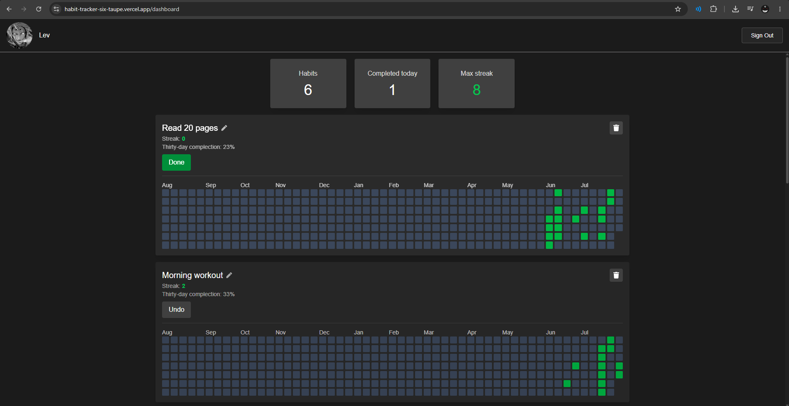
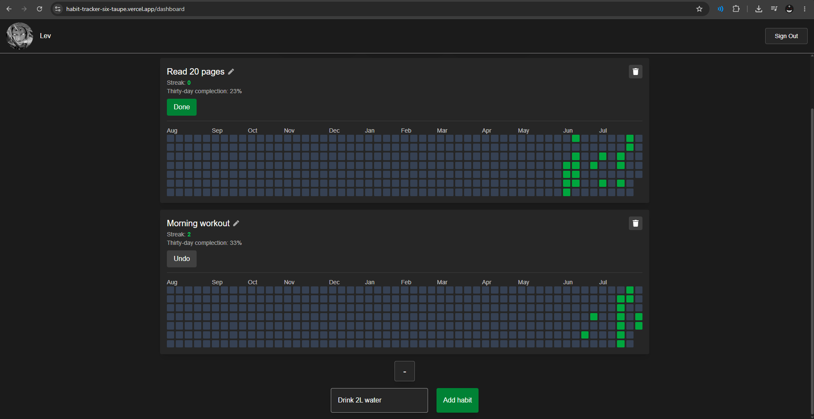
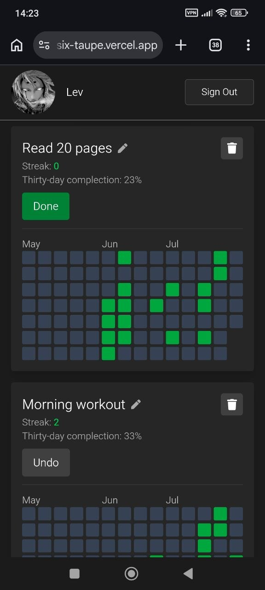

# Habit Tracker

**🔗 Live Demo:** https://habit-tracker-six-taupe.vercel.app/

A full-stack habit tracking application built with **Next.js**, **Auth.js**, and **Supabase**. It helps users build consistency through daily check-ins, streak tracking, and a GitHub-style yearly heatmap.

**Tech:** Next.js 16 • React 19 • TypeScript • Auth.js • Supabase • Tailwind CSS • Framer Motion

---

## Overview

A **habit** is any recurring activity you want to stay consistent with — reading, exercising, meditating, learning, and more.

Unlike a traditional to-do list, Habit Tracker focuses on **long-term consistency**. Every completion contributes to your current streak and is visualized in a GitHub-style contribution calendar, making progress easy to track throughout the year.

---

## Screenshots

### Dashboard

  

### Add Habit

  

### Mobile

  

---

## Features

- **GitHub OAuth authentication** via Auth.js v5 with Supabase-backed user accounts
- **Create, edit, complete, toggle, and delete habits** using Server Actions
- **Current streak** and **best streak** calculated from raw completion logs
- **GitHub-style yearly heatmap** with month labels and a fully responsive layout
- **Dashboard statistics** (total habits, completed today, best streak)
- **Inline habit editing** with optimistic UI updates and automatic rollback on failure
- **Animated list transitions** with Framer Motion
- **Toast notifications** for mutations and a dedicated `error.tsx` boundary
- **Custom loading skeletons** matching the final layout to eliminate layout shifts
- **Responsive UI** tested on real mobile Safari devices

---

## Tech Stack

- **Framework:** Next.js 16 (App Router, Server Components, Server Actions, Middleware)
- **Language:** TypeScript
- **UI:** React 19, Tailwind CSS v4
- **Authentication:** Auth.js v5 (GitHub OAuth)
- **Database:** Supabase (PostgreSQL)
- **Animations:** Framer Motion
- **Notifications:** Sonner
- **Deployment:** Vercel

---

## Architecture Notes

- User identity is decoupled from the OAuth provider. A stable UUID stored in the `users` table is used throughout the application instead of GitHub's user ID.
- Server Actions use a `success` / `attempt` counter pattern instead of boolean flags, allowing `useActionState` to reliably detect consecutive identical responses.
- Authentication is enforced at two layers: middleware for normal navigation and a server-side redirect as defense in depth.
- Mutation errors are returned as typed Server Action responses and displayed through toast notifications, while data-fetching errors are handled by a dedicated `error.tsx` boundary.

---

## Technical Challenges

- Reworked the streak algorithm to correctly reset only after an entire day is missed while preserving a same-day grace period.
- Built a fully responsive GitHub-style contribution calendar without hydration mismatches by resolving device type on the server instead of relying on `window.innerWidth`.
- Eliminated layout shifts between `loading.tsx` and the loaded page by applying `scrollbar-gutter: stable` only to the main content container.
- Fixed a mobile Safari-only overflow bug caused by a missing `min-w-0`, reinforcing the importance of testing on real devices instead of relying solely on browser emulation.

---

## Roadmap

- Rate limiting for Server Actions (Upstash / Vercel)
- `useOptimistic` for instant UI updates
- Habit categories and filtering
